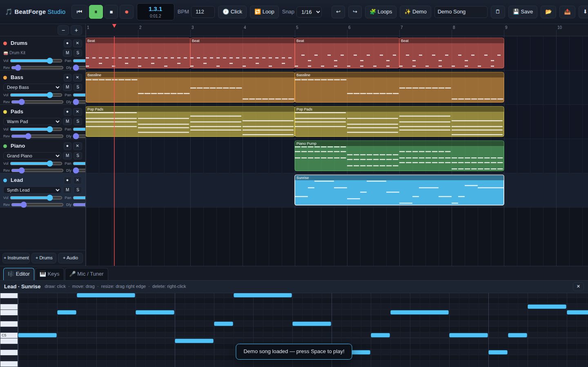

# 🎵 BeatForge Studio

A full music-production studio that runs entirely in your browser — no installs, no accounts, no servers. Build songs with synths, drums and loops, and **play your real instrument into the mic: BeatForge hears the notes you play and puts them straight into your song.**



## Quick start

```bash
# from the repo folder — any static server works
python3 -m http.server 8000
```

Then open **http://localhost:8000** in Chrome, Edge or Firefox.

> ⚠️ The microphone requires a *secure context*, so open the app via `http://localhost` (or any `https://` host, e.g. GitHub Pages) rather than double-clicking `index.html`. Everything except the mic also works from a plain `file://` open.

Press **✨ Demo** for an instant full song, then hit **Space**.

## 🎤 Play your instrument into the song

The headline feature — real instrument capture:

1. Open the **🎤 Mic / Tuner** tab and click **Enable Microphone**.
2. Play your guitar / keyboard / sax, or sing — the big tuner shows the exact note, cents offset and frequency it hears, live.
3. Arm a track (the ⏺ button on a track header) and choose a mode:
   - **Notes (MIDI)** — your playing is *transcribed into editable notes*. Play a riff on your guitar, then have the song play it back as piano, strings, bells… anything.
   - **Audio** — records the actual sound into an audio clip on an Audio track.
4. Press **⏺ Record** in the transport and play along with the click.
5. Press **Stop** — your take is in the arrangement. Open the clip and fix any note in the piano roll.

Pitch tracking uses an autocorrelation (ACF2+) detector with note-onset segmentation, so it follows single-note (monophonic) playing — riffs, basslines, melodies, vocals.

## Everything else in the box

| | |
|---|---|
| **Multi-track arrangement** | Unlimited instrument / drum / audio tracks, draggable & resizable clips, clip duplicate, snap grid (1/4 → 1/32), zoom, loop region on the ruler |
| **9 built-in instruments** | Grand Piano, E-Piano, Organ, Synth Lead, Warm Pad, Strings, Deep Bass, Pluck, Bells — all synthesized live with Web Audio |
| **Drum machine** | 9-piece synthesized kit (kick, snare, clap, hats, toms, ride, crash) with a classic step-sequencer grid |
| **Piano roll editor** | Click to draw notes, drag to move/transpose, drag edges to resize, right-click to delete |
| **Virtual keyboard** | 3 octaves, mouse or computer-keys (A W S E D F T G Y H U…), octave shift, records into the song while the transport records |
| **Mixer & FX** | Per-track volume, pan, mute, solo, reverb send and tempo-synced delay send; master bus compressor |
| **Loops library** | Ready-made drum beats, basslines, chord progressions, melodies and arps — one click drops them at the playhead |
| **Transport** | Play/pause, stop, record, metronome, loop region, BPM 40–240, bar.beat.16th + minutes:seconds display |
| **Undo / redo** | 60 levels, `Ctrl+Z` / `Ctrl+Y` |
| **Save & open** | Auto-saves to your browser every 30 s; 💾 saves on demand; 📤/📂 download & reopen portable `.beatforge.json` project files (recorded audio included) |
| **Export** | ⬇ **WAV** renders your whole mix offline to a 44.1 kHz stereo `.wav` file |

## Keyboard shortcuts

| Key | Action |
|---|---|
| `Space` | Play / pause |
| `R` | Record |
| `M` | Metronome |
| `L` | Loop on/off |
| `Ctrl+Z` / `Ctrl+Y` | Undo / redo |
| `Ctrl+D` | Duplicate selected clip |
| `Ctrl+S` | Save |
| `Delete` | Delete selected clip / note |
| `A`–`P` row | Play notes (Keys tab) |
| `Z` / `X` | Octave down / up (Keys tab) |

## Project layout

```
index.html        app shell & layout
css/style.css     dark studio theme
js/engine.js      Web Audio engine: instruments, drums, FX buses, WAV encoder
js/pitch.js       microphone input, autocorrelation pitch detection, audio capture
js/app.js         tracks, transport/scheduler, arrangement, piano roll,
                  drum grid, keys, loops, mixer, save/load/export
```

No frameworks, no build step, no dependencies — plain HTML/CSS/JS on the Web Audio API.
